# API-Explorer

## 下载了Releases版本后，需要在源码页面将ApiInfo2.0.db文件下载到本地放到程序目录

## **废话篇：**

工具初衷是做一个小程序、公众号、企业微信、飞书、钉钉等泄露secert后利用工具，后来发现几家接口有一定区别，认证等参数分布在不同位置，索性就做成一个比较通用的工具了。目前可以定义：请求类型、url、header、body、正则提取认证token、接口参数说明。

## **功能介绍**

​	API-Explorer是一款管理api接口的工具，可提前配置好接口，直接调用即可；可定义数据包任何位置内容，使用起来相当灵活。
| 应用       | 功能     | 数据库接口       |
| ---------- | -------- | ---------------- |
| 微信公众号 | 支持     | 完成部分常用功能 |
| 微信小程序 | 支持     | 完成部分常用功能 |
| 企业微信   | 支持     | 完成部分常用功能 |
| 钉钉      | 支持     | 完成部分常用功能  |
| 飞书      | 支持     | 只写了两个接口    |
| 腾讯地图   | 支持     | 完成部分常用功能  |
| 高德地图   | 支持     | 完成部分常用功能  |
| 百度地图   | 支持     | 完成部分常用功能  |

完成部分都是挖洞遇到过的key，边写边测试，如果遇到一些特殊情况无法使用可提交Issues或者联系“刨洞安全团队”公众号后台留言。

如果有人愿意借用下key就可以继续完善，愿意贡献者联系“刨洞安全团队”公众号

## **更新说明**
**v2.1.0**

功能变化：

1、增加代理功能
2、修复已知bug

使用说明：

由于钉钉分为三种应用类型，目前只写了常见的内部应用开发。

由于钉钉的认证授权与功能模块使用的api域名不同，所以分成了两个应用写，分别是“钉钉-获取凭证”与“钉钉-其他功能”，使用时先用“钉钉-获取凭证”获取token，然后使用“钉钉-其他功能”调用其他接口。

**v2.0.0**

功能变化：

1、新增自定义baseurl，能更好的应对私有化环境
2、增加对飞书接口的支持

使用说明：

application增加baseurl列，可在此列填写应用基础路径，能更好统一接口请求路径

function表中url字段，可以是路径，也可以是完整url

优先级方面，以应用界面baseurl为最高，如果未设置则使用接口表中

## **使用场景**

场景1-(公众号appid，secert泄露利用)：

1、获取accesstoken

​	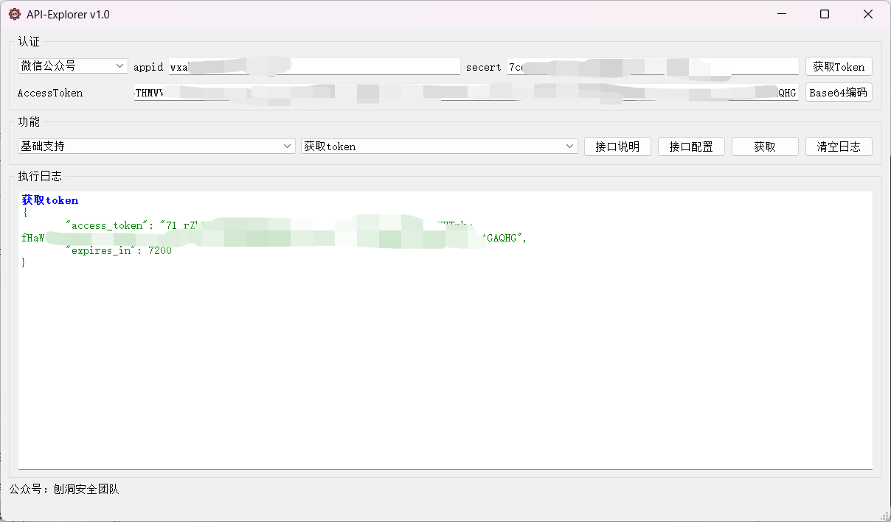

2、使用此token访问其他接口

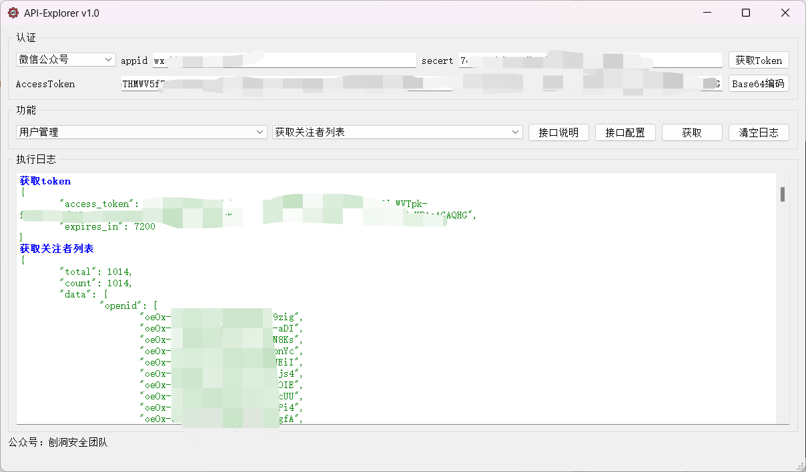

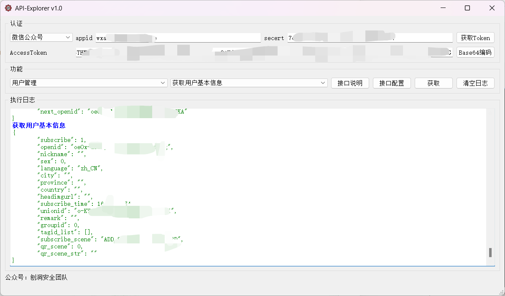

有些时候拿到的appid跟secert公众号用不了，其实是它没有公众号，只有小程序，可以先用公众号接口获取token然后使用小程序接口获取其对应信息。

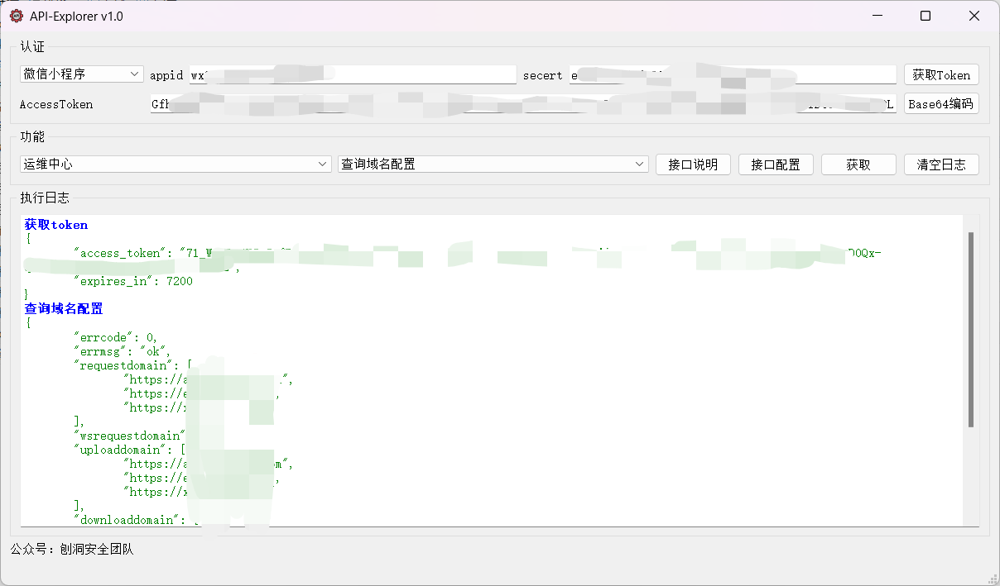

地图系列
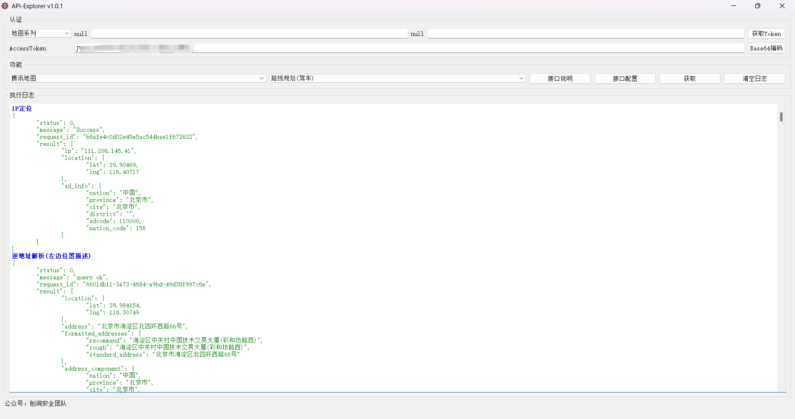

场景2-(设备巡检)：

绿盟扫描器

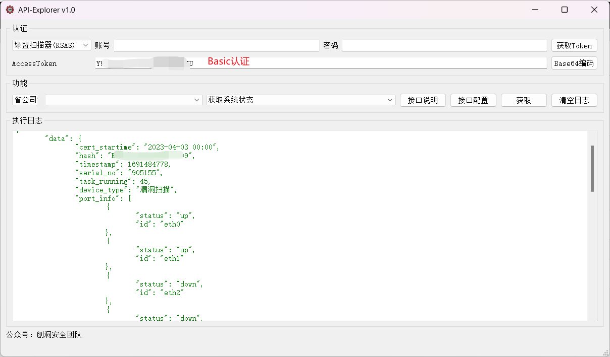

绿盟UTS

获取token，注意这里密码加密后的，为了通用工具不做任何加密，所以加好密传入才行。获取加密办法：

f12后登录页面输入账号密码，找到authen_user接口，获取password内容即可。这个密码可复用，只要不改密码就可以一直用。

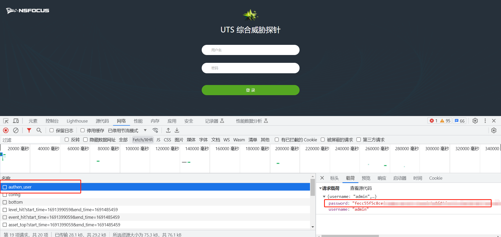

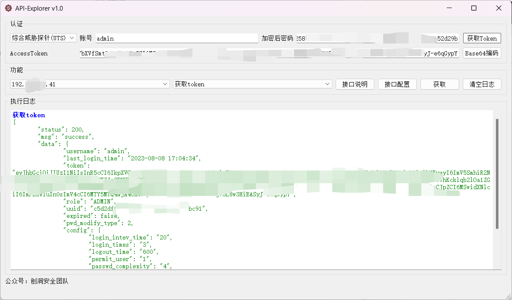

使用token获取设备信息

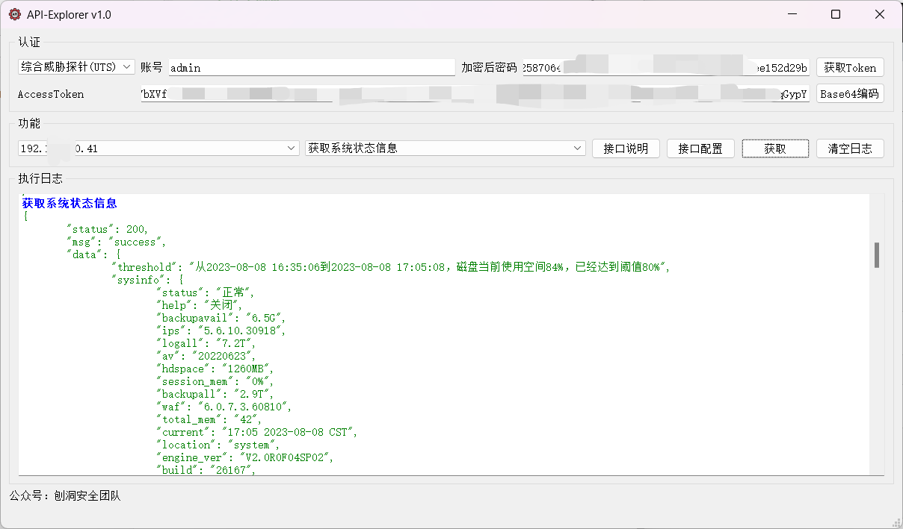

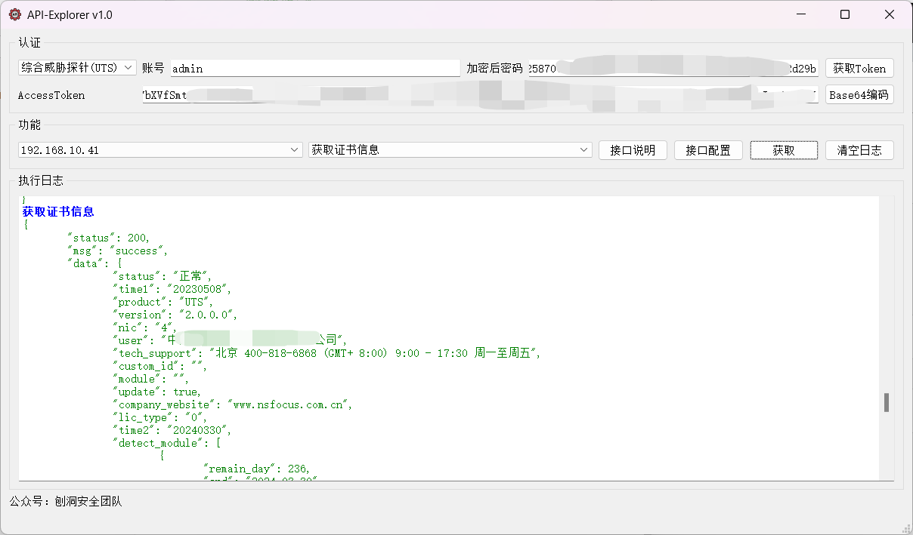

场景3-(签到类)：

​	没有实践，目前支持账号密码登录获取cookie，可以再加个签到接口即可。

## 使用说明

### **认证区域**

- 由于标签可能不一样，第一行第一个就以id标识，第二个以key表示，第二行以token表示

- 目前考虑的认证有三种，分别是：

  1. 账号密码获取token(响应body)

  1. 账号密码获取cookie(响应头)

  1. 使用固定请求头，例如Basic认证或者api授权key

- 前两者需要输入id跟key获取token再使用，所以需要先点击"获取Token"，如果能获取到Token将会自动填充在token处

- 如果是第三种方式直接填写token使用即可。

- Basic认证可直接输入"账号:密码"，然后点击Base64编码即可。

### **功能区域**

两个下拉框第一个是分组，第二个是接口。为了防止接口数量太多使用起来不便，所以尽量对接口分组。

"接口说明"点击弹出内容为该接口请求与响应字段信息，方便使用。

"接口配置"可对配置接口值进行修改。说明：该处修改会影响数据库默认数据，但不影响有特殊标识的字段。

"获取"功能即请求该接口，并将响应输出到日志区。

"清空日志"回将日志区内容清空。

### **日志区域**

为了展示所有内容，不好以可视化或者其他方式展示，直接将响应body原样输出了。(暂时没想到，如果有方案可以指导下)

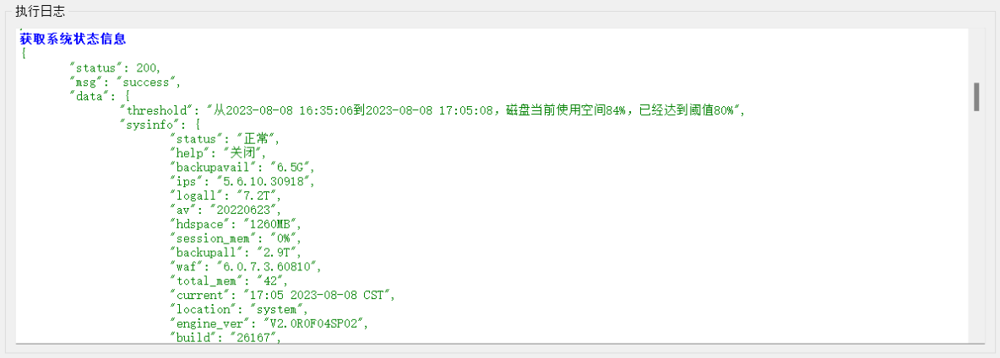

## 接口编写

### 数据库关系结构图

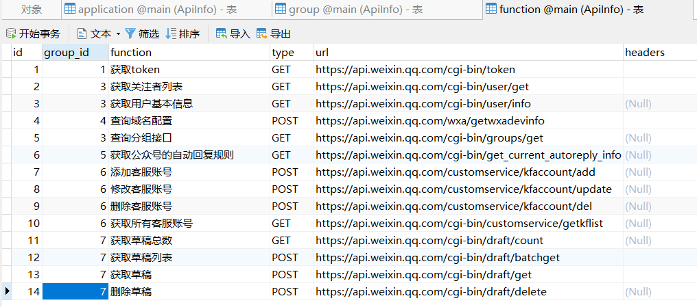

### 流程

1. 先在application表创建应用，如果有就忽略，id_tab跟key_tab是第一行两个输入框的table名。
2. 在group表创建分组，这个随意分，主要用于接口多好区分，app_id对应应用的id。
3. 最关键的一步就是function表了，写接口详情的，接下来重点也是讲这个。

### 接口信息创建

**字段信息**

| 字段         | 作用                                                         |
| ------------ | ------------------------------------------------------------ |
| id           | 唯一ID                                                       |
| group_id     | 分组id                                                       |
| function     | 接口名，在下拉框处显示的名字                                 |
| type         | 请求类型，GET or  POST                                       |
| url          | 请求url                                                      |
| headers      | 请求头                                                       |
| get_params   | get参数                                                      |
| content_type | body类型，目前仅支持x-www-form-urlencoded与json              |
| post_params  | post参数                                                     |
| is_token     | 是否为token接口，该字段必填，如果不是获取token接口为0，反之为1 |
| token_re     | 响应内容提取token的正则表达式                                |
| api_doc      | 接口文档或说明，爱怎么写怎么写，有换行可以在记事本写好复制进去。 |

### 说明

- 目前接口配置中内置三个特殊标识，{id},{secert},{token}，分别对应第一排两个输入框与第二排一个输入框。表示从输入框获取值。

  

  注：特殊标识可使用在headers、get_params、post_params

- "接口说明"弹窗内容对应api_doc内容

- "接口配置"可修改内置默认参数值（只做修改不能增删），但不影响特殊标识内容。

- get参数、header以及json跟from格式的body，都以“参=值&参=值”的形式表达。

- json跟列表嵌套，嵌套内容在不支持单独修改，所以嵌套内容需要这样写：

  原数据：{"a":"1","b":"2","c":{"aaa":"111"},"d":[1,2,3]}写成a="1"&b="2"&c={"aaa":"111"}&d=[1,2,3]

- content_type目前仅支持application/x-www-form-urlencoded与application/json

### 示例

第一组示例

| 字段         | 示例                                                         | 说明                                                         |
| ------------ | ------------------------------------------------------------ | ------------------------------------------------------------ |
| id           | 1                                                            | 自动递增，无需理会                                           |
| group_id     | 1                                                            | 对应组ID，按需填入                                           |
| function     | 获取token                                                    | 接口名，下拉处显示                                           |
| type         | GET                                                          | 请求方法                                                     |
| url          | https://api.weixin.qq.com/cgi-bin/token                      | 接口URL                                                      |
| headers      |                                                              | 没有特殊需求即留空                                           |
| get_params   | grant_type=client_credential&appid={id}&secret={secert}      | client_credential为预设参数 {id}代表从输入框1获取 {secert}代表从输入框2获取 |
| content_type |                                                              | 没有特殊需求即留空                                           |
| post_params  |                                                              | 没有特殊需求即留空                                           |
| is_token     | 1                                                            | 如果为1，点击"获取token"时就会调用该接口。 但同一个分组下有多个只会取第一个 |
| token_re     | "access_token":"([\w\-]+)"                                   | 用于正则提取body中token的正则表达式                          |
| api_doc      | 本接口获取token grant_type参数值固定为client_credential appid与secert为用户传入 | 接口描述                                                     |

第二组示例

| 字段         | 示例                                                         | 说明               |
| ------------ | ------------------------------------------------------------ | ------------------ |
| id           | 12                                                           | 自动递增，无需理会 |
| group_id     | 7                                                            | 对应组ID，按需填入 |
| function     | 获取草稿列表                                                 | 接口名，下拉处显示 |
| type         | POST                                                         | 请求方法           |
| url          | https://api.weixin.qq.com/cgi-bin/draft/batchget             | 接口URL            |
| headers      | Authorization=Basic {token}                                  | 请求头             |
| get_params   | accept=json                                                  | get参数            |
| content_type | application/json                                             | body内容格式       |
| post_params  | {"params1":"value1","params2":"value2"}                      | post参数           |
| is_token     | 0                                                            | 是否为token接口    |
| token_re     |                                                              | 不是token接口留空  |
| api_doc      | 相应内容： offset	 从全部素材的该偏移位置开始返回，0表示从第一个素材返回 count	 返回素材的数量，取值在1到20之间 no_content	 1 表示不返回 content 字段，0 表示正常返回，默认为 0 | 接口描述           |

